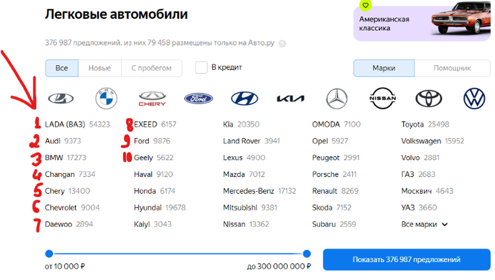

# TrainingData.Solutions Interview Task
[](https://github.com/psf/black)

Test task for the position of technical support trainee with knowledge of Python at [TrainingData](https://trainingdata.notion.site/TrainingData-Solutions-716057e76ab64e0988c39f381a8987ec)


## Description
`1. Parsing task`
Nowadays the area of data parsing and scraping is actively developing. The number of orders for such services is growing exponentially, and data sets for the showroom are being collected in the Datamarket. In this regard, the first test task will be in this direction:

Write a parser for the store [auto.ru](https://auto.ru/)). Collect up to 5 photos (in maximum quality) from one ad. Take up to 10 advertisements. You need to parse the first 10 brands from the list on the main page:



Sorting: a folder with the name of the car brand, inside a folder with a photo, with the name of the advertisement, each of which contains a photo:


You need to send an archive with a photo and a parser code.

## Getting Started

### Installing
1. Clone the repository:
```
git clone <repo>
```
2. Install the required packages:
```
python -m pip install -r ./requirements.txt
```

### Executing program
Run the script:
```
python scrape.py
```